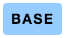

# Styleguide Base

This project is intended to be used as a basis for a styleguide. It aims to show code next to a visual representation of the result in an easy-to-edit format.

# Examples

Here we list all our components.

## Base Button

This is a base button.

```html
<button class="base-button">Base</button>
```



# Workflow

First clone and `npm install` this repo.

Then start the parcel dev-server with `npm start`. Edit files in `src` folder and watch the result at [localhost:1234](http://localhost:1234).

Add an element with an id like so:
`<button id="example-button" class="base-button">Hit me</button>`

We have a `tools/generate-images.js` node.js script which:

-   finds every named (with id) element in `src/index.html`
-   takes a screenshot of the element
-   saves it as `images/{id-of-element}.png`

Run `node tools/generate-images.js`.

Now you can add your component example with code and visuals:

````markdown
```html
<button class="base-button">Hit me</button>
```


````

Which produces the following:

```html
<button class="base-button">Hit me</button>
```


